This is a [Next.js](https://nextjs.org) project bootstrapped with [`create-next-app`](https://nextjs.org/docs/app/api-reference/cli/create-next-app).

## Microbank

A full-stack microbanking platform built with Next.js, Prisma, Supabase, and JWT.
Allows secure client registration, deposits, withdrawals, and blacklist management with a clean admin panel and Swagger API documentation.

🌐 Live Demo: [Microbank on Vercel](https://microbank-bbkzmzj2k-liquid-dres-projects.vercel.app/)
💻 Source Code: [GitHub Repo](https://github.com/liquid-dre/microbank.git)

### Getting Started

Admin credentials
```
email : admin@gmail.com
password: Password01
```

### Features

#### Client Service
	•	Register as a client (email, name, password)
	•	JWT login & authentication
	•	View current profile
	•	Admin can blacklist clients
	•	Blacklisted clients cannot transact

#### Banking Service
	•	Deposit & withdraw funds
	•	Prevent overdrafts
	•	Track account balance & transaction history
	•	All transactions are recorded
	•	Blacklisted clients are blocked from transactions

#### Frontend
	•	Client App: Register, login, dashboard, transactions
	•	Admin Panel: List clients & toggle blacklist
	•	Blacklist Error Handling


### Project Structure

```bash
microbank/
├── client/                     # Frontend (Next.js)
│   ├── pages/
│   └── components/
│
├── services/
│   ├── client-service/         # Registration, Login, JWT Auth, Blacklist
│   └── banking-service/        # Deposits, Withdrawals, Transactions
│
├── prisma/                     # Prisma schema & migrations
├── public/                     # Static assets
└── README.md                   # Project documentation
```

### Tech Stack

	•	Frontend: Next.js 14, React, Tailwind CSS (if used)
	•	Backend: Next.js API Routes
	•	Database: Supabase (PostgreSQL with Prisma)
	•	Authentication: JSON Web Tokens (JWT)
	•	API Docs: Swagger (available at /api/docs)

### Setup & Installation

1️⃣ Clone the Repository
```
    git clone https://github.com/liquid-dre/microbank.git
    cd microbank
```

2️⃣ Install Dependencies
```
    npm install
```

3️⃣ Setup Environment Variables
Generate JWT secret via Bash:
```
    openssl rand -base64 32
```

Create a .env file in the project root:
```
    DATABASE_URL="postgresql://<your-db-url>?pgbouncer=true&sslmode=require"
    DIRECT_URL="postgresql://<your-db-url>?sslmode=require"

    JWT_SECRET="<your-jwt-secret>"

    SUPABASE_SERVICE_ROLE_KEY="<your-service-role-key>"

    NEXT_PUBLIC_SUPABASE_URL="<your-supabase-url>"
    NEXT_PUBLIC_SUPABASE_ANON_KEY="<your-anon-key>"
```

4️⃣ Run Database Migrations
```
    npx prisma migrate dev
```

5️⃣ Run the App Locally
```
    npm run dev
```

Visit → [localhost](http://localhost:3001)

### API Documentation

Interactive Swagger docs:
```
    https://microbank-bbkzmzj2k-liquid-dres-projects.vercel.app/api/docs
```
Visit → [Swagger API Docs](https://microbank-bbkzmzj2k-liquid-dres-projects.vercel.app/api/docs) 

#### Example: Register Client
```
    POST /services/client-services/auth/register
    Content-Type: application/json

    {
    "name": "user",
    "email": "user@example.com",
    "password": "123456"
    }
```

### Assumptions & Limitations

	•	Works best on Google Chrome
	•	JWT authentication secures all endpoints
	•	Demo project → No email verification
	•	Blacklisting instantly blocks transactions

### Future Improvements

	•	Email verification & password reset
	•	Improved performance on other browsers

### Screenshots 

- Landing page
    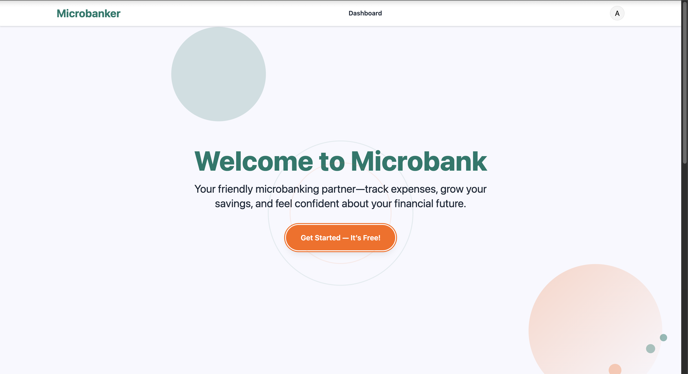
    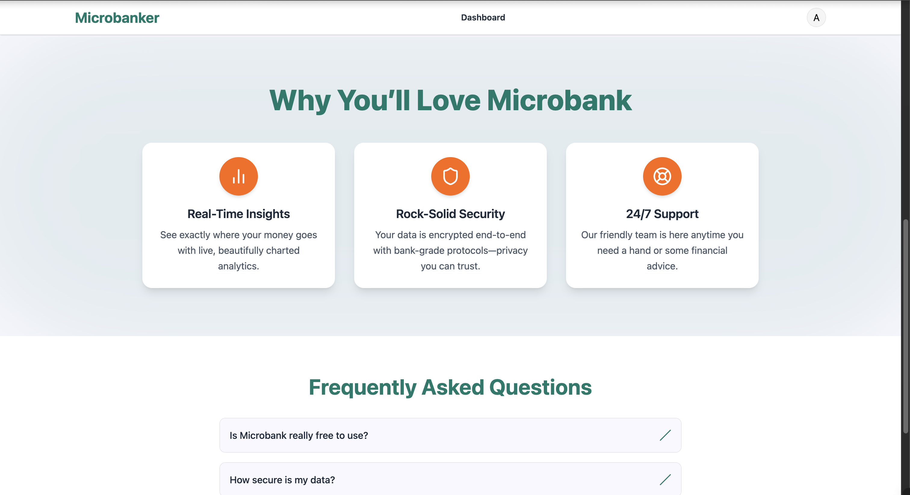
    

- Register page
    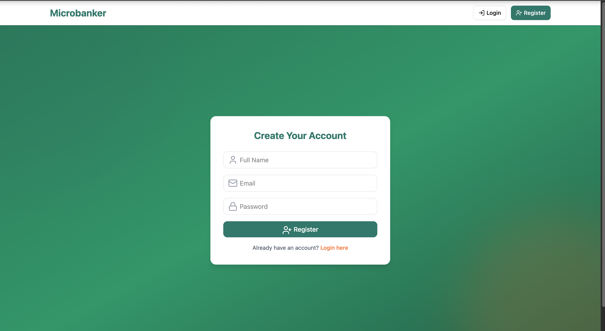    

- Login page
    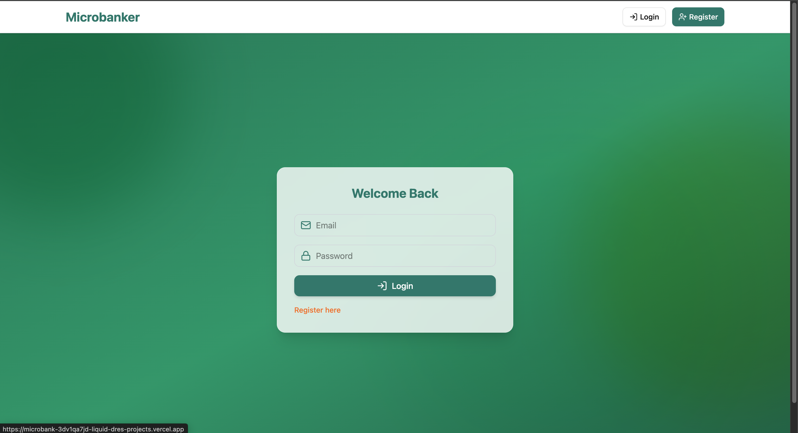

- Admin dashboard page
    

- Edit profile page
    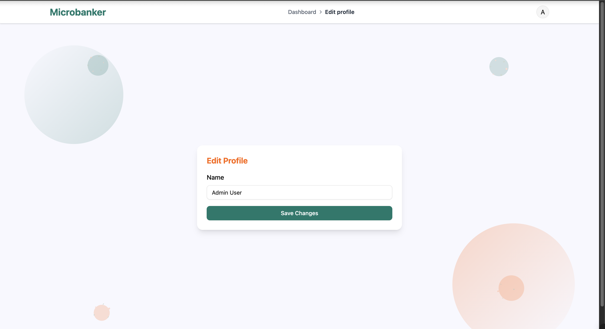

- Client dashboard
    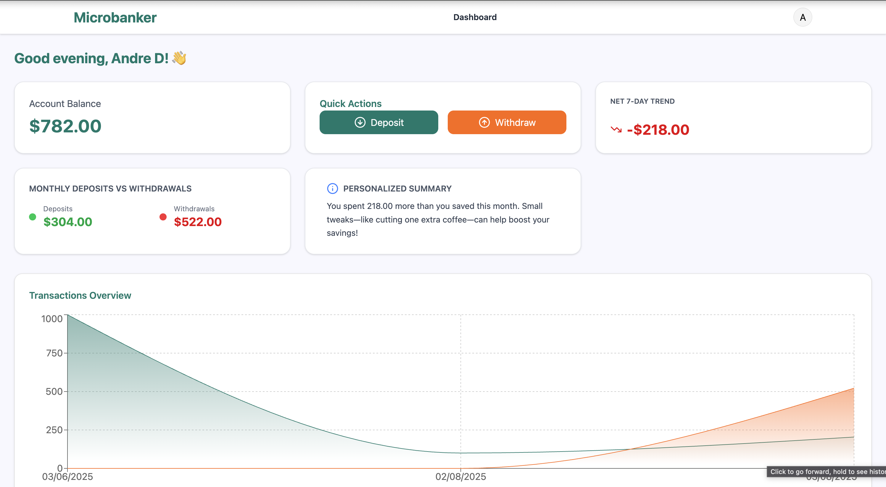

    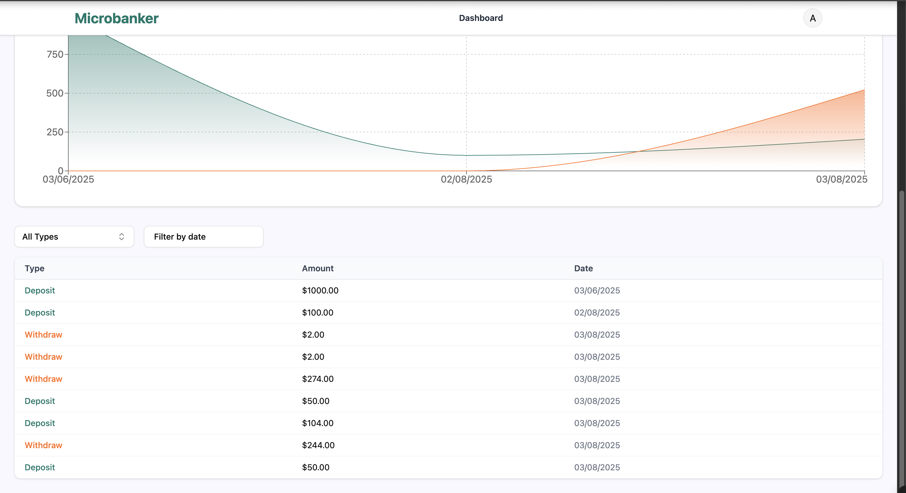

    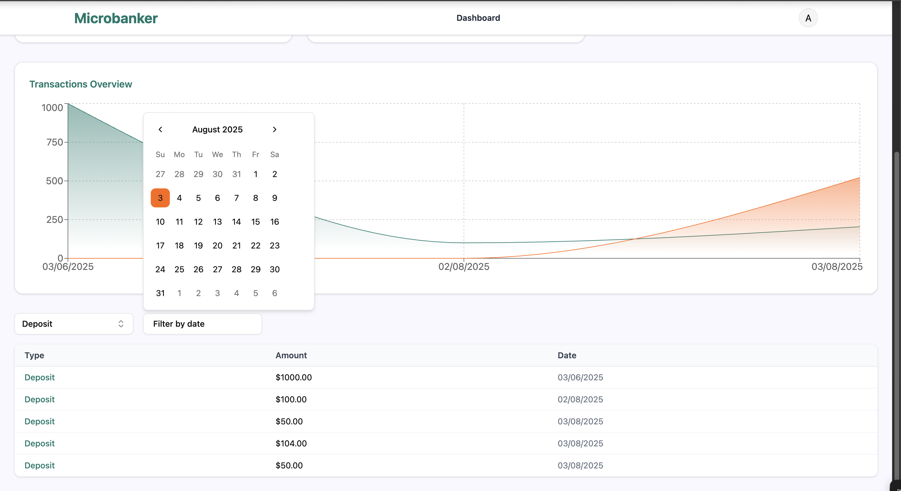

    - Deposit page
    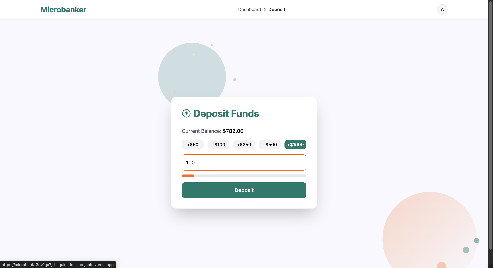

    - Withdraw page (25% selected)
    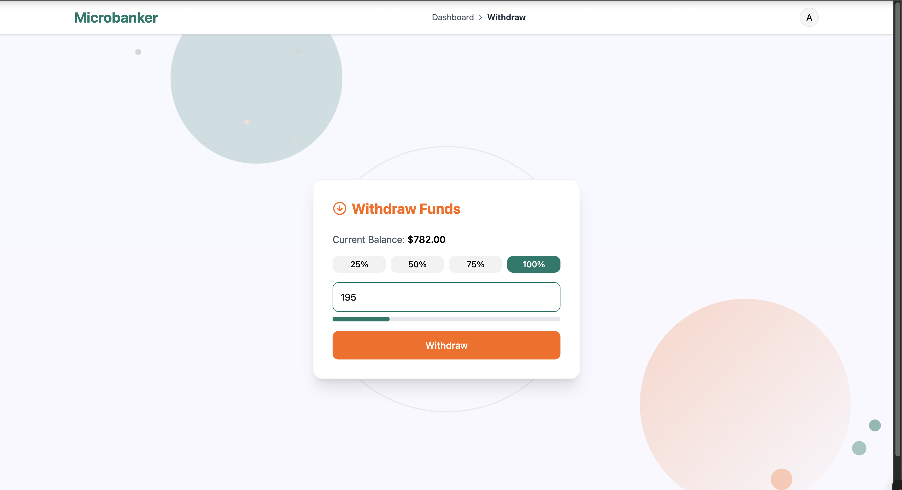

    - Withdrawal validation
    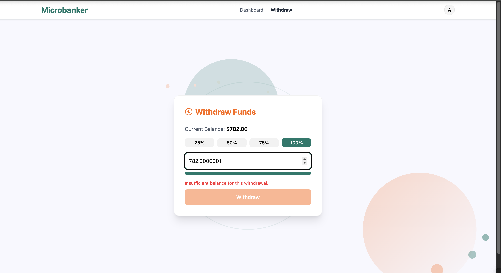

- Blacklisted user dashboard
    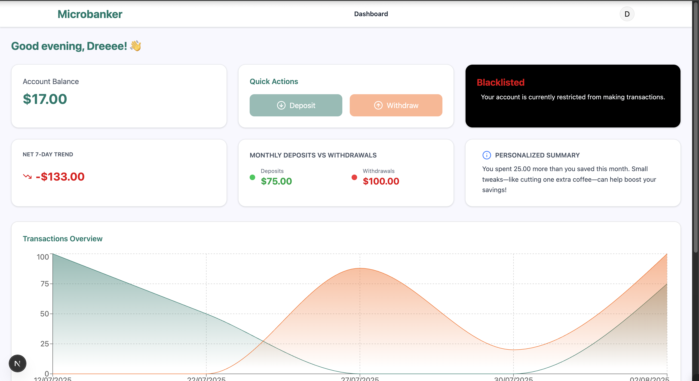


### 🧠 Developer Thoughts

I wanted to share a bit about my journey building this project:

I had never worked with JWT directly before (I usually rely on Clerk for personal projects), so that was a bit challenging at first.
But if there’s anything I believe in, it’s my ability to see a problem through—and, of course, read documentation 🤣.
	•	Saturday: I started the project in the morning, and by the time I went to sleep, the core functionalities were done.
	•	Sunday: I realized I had misread the required project structure, which meant restructuring imports and cleaning up my backend code.
	•	This turned out to be a blessing in disguise, as I got to refactor my lib/api.ts for cleaner and easier API calls and made a bunch of styling changes just to put my own personal touch and favourite colour (green)

I also reflected on real-world practicality:

Letting users just pick any deposit amount felt unrealistic without a verification step to ensure they actually had the funds.
I almost redesigned the project to focus on withdrawals & transfers instead, but in the end I stuck to the brief—imagining a system like Apple Pay or a linked e-wallet handling the actual funds.

The short timeframe was actually exhilarating:
	•	Friday night: Designed my screens and DB schema
	•	Saturday & Sunday: Built and refined the core app
	•	Deployment: Of course, everything went haywire at first 😅, but debugging and fixing that was its own kind of fun.

Overall, I enjoyed every part of the process, and I hope the effort and care I put into this project comes through to anyone who inspects the repo or tries the app.